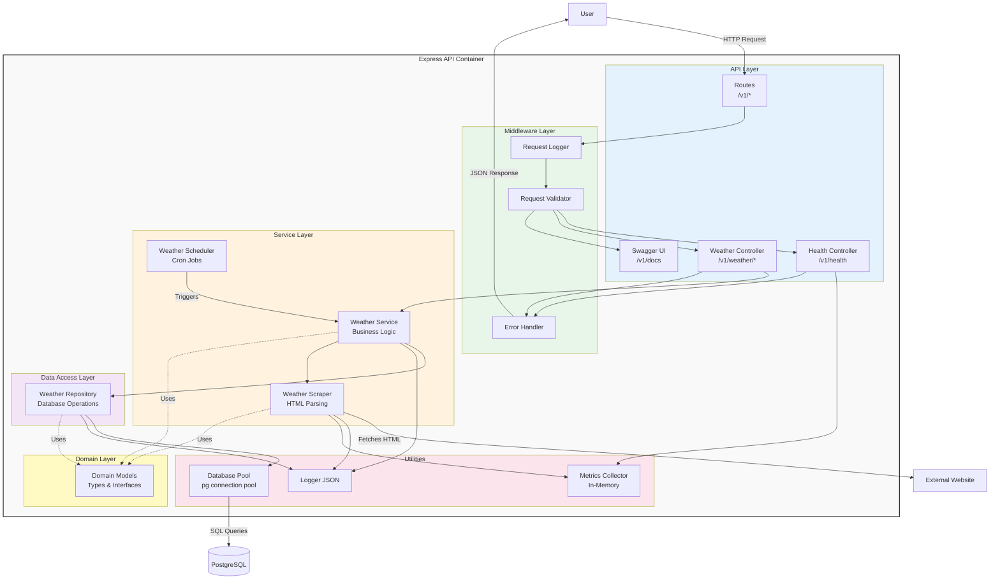

# C4 Component Diagram - Malta Weather API

This diagram shows the internal components of the Express API container and how they interact.

## Component Descriptions

### API Layer (Controllers & Routes)

**Routes** (`src/api/routes.ts`)
- Maps HTTP endpoints to controller methods
- Applies middleware (validation, logging)
- Defines v1 API structure

**Health Controller** (`src/api/healthController.ts`)
- Endpoint: `GET /v1/health`
- Checks database connectivity
- Returns scraper metrics
- Status: 200 (healthy) or 503 (unhealthy)

**Weather Controller** (`src/api/weatherController.ts`)
- Endpoint: `GET /v1/weather/current`
- Endpoint: `GET /v1/weather/forecast?days=1-6`
- Retrieves data from WeatherService
- Returns JSON responses
- Handles errors with ApiError

**Swagger UI** (`src/app.ts`)
- Endpoint: `GET /v1/docs`
- Serves interactive API documentation
- Loads OpenAPI specification from YAML
- Provides API testing interface

### Middleware Layer

**Error Handler** (`src/middleware/errorHandler.ts`)
- Catches all errors in the application
- Converts to RFC 7807 Problem Details format
- Sets content-type: `application/problem+json`
- Logs errors with full context

**Validator** (`src/middleware/validation.ts`)
- Validates query parameters using Joi
- Enforces constraints (e.g., days: 1-6)
- Returns 400 errors for invalid input
- Sanitizes user input

### Service Layer

**Weather Service** (`src/services/weatherService.ts`)
- Orchestrates scraping and data persistence
- Coordinates between scraper and repository
- Handles business logic
- Tracks metrics (success/failure rates)
- Entry point for scheduled and manual scrapes

**Weather Scheduler** (`src/services/scheduler.ts`)
- Uses node-cron for scheduling
- Triggers scraping every 30 minutes
- Runs initial scrape on startup
- Prevents concurrent scrapes
- Provides manual trigger capability

**Weather Scraper** (`src/services/scraper.ts`)
- Fetches HTML from external website
- Parses HTML with Cheerio
- Extracts current weather and forecast
- Normalizes data to domain models
- Implements retry logic with exponential backoff
- Respects timeout and User-Agent settings

### Data Access Layer

**Weather Repository** (`src/repositories/weatherRepository.ts`)
- Abstracts database operations
- CRUD operations for weather data
- Implements deduplication logic
- Uses PostgreSQL connection pool
- Methods:
  - `saveCurrentWeather()`: Insert with deduplication
  - `getCurrentWeather()`: Get latest observation
  - `saveForecast()`: Insert forecast day
  - `getForecast(days)`: Get N-day forecast
  - `cleanupOldData()`: Delete data >30 days

### Domain Layer

**Domain Models** (`src/domain/models.ts`)
- TypeScript interfaces for data structures
- `CurrentWeather`: Current conditions
- `ForecastDay`: Single day forecast
- `WeatherObservation`: Database entity
- `WeatherForecast`: Database entity
- `ScraperMetrics`: Performance metrics
- Pure data structures, no business logic

### Utilities

**Logger** (`src/utils/logger.ts`)
- Winston-based structured logging
- JSON format for parsing
- Multiple transports (console, file)
- Log levels: info, warn, error
- Includes timestamps and context

**Metrics Collector** (`src/utils/metrics.ts`)
- In-memory metrics storage
- Tracks:
  - `scrape_success_total`
  - `scrape_failure_total`
  - `scrape_duration_seconds`
  - Last scrape time and status
- Extensible to Prometheus

**Database Pool** (`src/utils/database.ts`)
- PostgreSQL connection pooling
- Pool size: 10 connections
- Connection timeout: 10s
- Idle timeout: 30s
- Database initialization (create tables)
- Health check utility

## Data Flow

### Scraping Flow
1. **Scheduler** triggers **WeatherService** every 30 minutes
2. **WeatherService** calls **WeatherScraper**
3. **WeatherScraper** fetches HTML from **External Website**
4. **WeatherScraper** parses HTML and creates **Domain Models**
5. **WeatherService** passes models to **WeatherRepository**
6. **WeatherRepository** inserts data into **PostgreSQL** (with deduplication)
7. **Metrics** are updated (success/failure, duration)
8. **Logger** records the operation

### API Request Flow
1. **User** makes HTTP request to **Routes**
2. **Request Logger** logs the request
3. **Validator** validates query parameters
4. **Controller** receives validated request
5. **Controller** calls **WeatherService**
6. **WeatherService** calls **WeatherRepository**
7. **WeatherRepository** queries **PostgreSQL**
8. Data flows back through layers to **Controller**
9. **Controller** formats JSON response
10. **Error Handler** catches any errors
11. Response sent to **User**

## Design Patterns

- **Repository Pattern**: Abstracts data access (WeatherRepository)
- **Service Layer**: Business logic separated from controllers
- **Dependency Injection**: Services receive dependencies in constructor
- **Middleware Chain**: Request processing pipeline
- **Strategy Pattern**: Scraper implementation is swappable
- **Singleton**: Logger, Metrics, Database Pool

