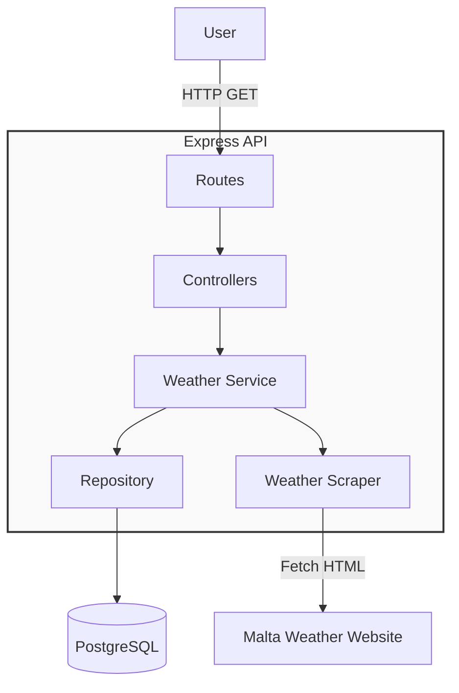

# C4 Component Diagram - Malta Weather API

This diagram shows the internal components of the Express API and how they interact.

## Architecture Layers

### API Layer
- **Routes** (`src/api/routes.ts`) - Maps endpoints to controllers
- **Controllers** (`src/api/*.Controller.ts`) - Handle HTTP requests/responses
  - Health: `GET /v1/health`
  - Weather: `GET /v1/weather/current`, `GET /v1/weather/forecast?days=1-6`

### Service Layer
- **Weather Service** (`src/services/weatherService.ts`) - Business logic orchestration
- **Weather Scraper** (`src/services/scraper.ts`) - Fetches and parses external HTML
- **Scheduler** (`src/services/scheduler.ts`) - Runs scraper every 30 minutes

### Data Layer
- **Repository** (`src/repositories/weatherRepository.ts`) - Database operations
- **Models** (`src/domain/models.ts`) - TypeScript interfaces

## Key Flows

**Scraping**: Scheduler → Service → Scraper → Parse HTML → Repository → Database

**API Request**: User → Routes → Controller → Service → Repository → Database → Response

## Patterns Used
- Repository Pattern (data access abstraction)
- Service Layer (business logic separation)
- Dependency Injection (loose coupling)
- Middleware Chain (request processing)