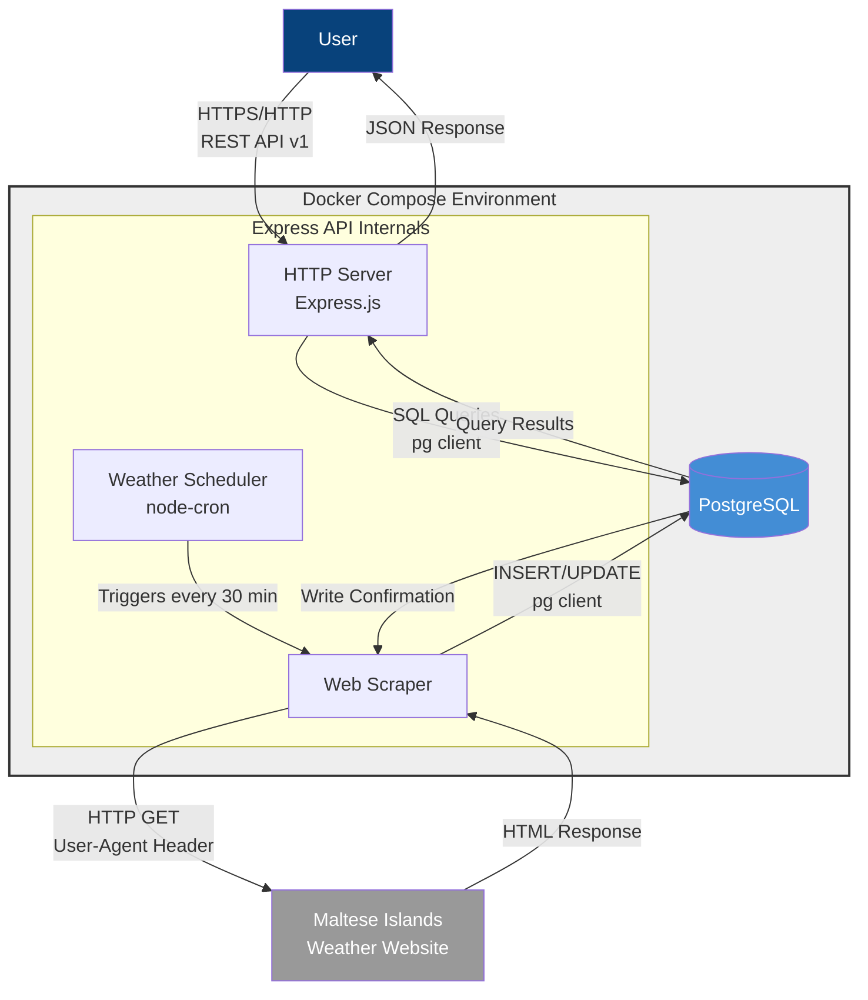

# C4 Container Diagram - Malta Weather API

This diagram shows the high-level containers (applications and data stores) that make up the Malta Weather API system.

## Description

The system consists of two main containers running in Docker Compose:

### 1. Express API Container
- **Technology**: Node.js 20 on Alpine Linux
- **Port**: 3000 (exposed to host)
- **Components**:
  - **HTTP Server**: Handles REST API requests using Express.js framework
  - **Weather Scheduler**: Cron job that triggers scraping every 30 minutes
  - **Web Scraper**: Fetches and parses HTML from external website
- **Responsibilities**:
  - Serve REST API endpoints (health, current weather, forecast)
  - Schedule and execute web scraping operations
  - Parse HTML and normalize data
  - Store data in database
  - Provide OpenAPI documentation via Swagger UI

### 2. PostgreSQL Database Container
- **Technology**: PostgreSQL 15 on Alpine Linux
- **Port**: 5432 (internal to Docker network)
- **Storage**: Named volume for data persistence
- **Tables**:
  - `current_weather`: Current weather observations
  - `weather_forecast`: Forecast data for upcoming days
- **Responsibilities**:
  - Persistent storage of weather data
  - Deduplication via UNIQUE constraints
  - Fast querying with indexes
  - Data integrity (ACID compliance)

### Container Communication

**API Consumer → Express API**:
- Protocol: HTTP/HTTPS
- Format: JSON
- Endpoints: /v1/health, /v1/weather/current, /v1/weather/forecast

**Express API → PostgreSQL**:
- Protocol: PostgreSQL wire protocol
- Client: pg (node-postgres)
- Connection: Connection pooling (10 connections)

**Express API → External Website**:
- Protocol: HTTP
- Method: Automated scraping every 30 minutes
- Headers: Custom User-Agent for identification
- Resilience: Exponential backoff, timeouts, retries

### Deployment

Both containers are defined in `docker-compose.yml`:
- Health checks on both containers
- Dependency management (app waits for database)
- Environment-based configuration
- Volume mounts for data persistence
- Network isolation (internal Docker network)

