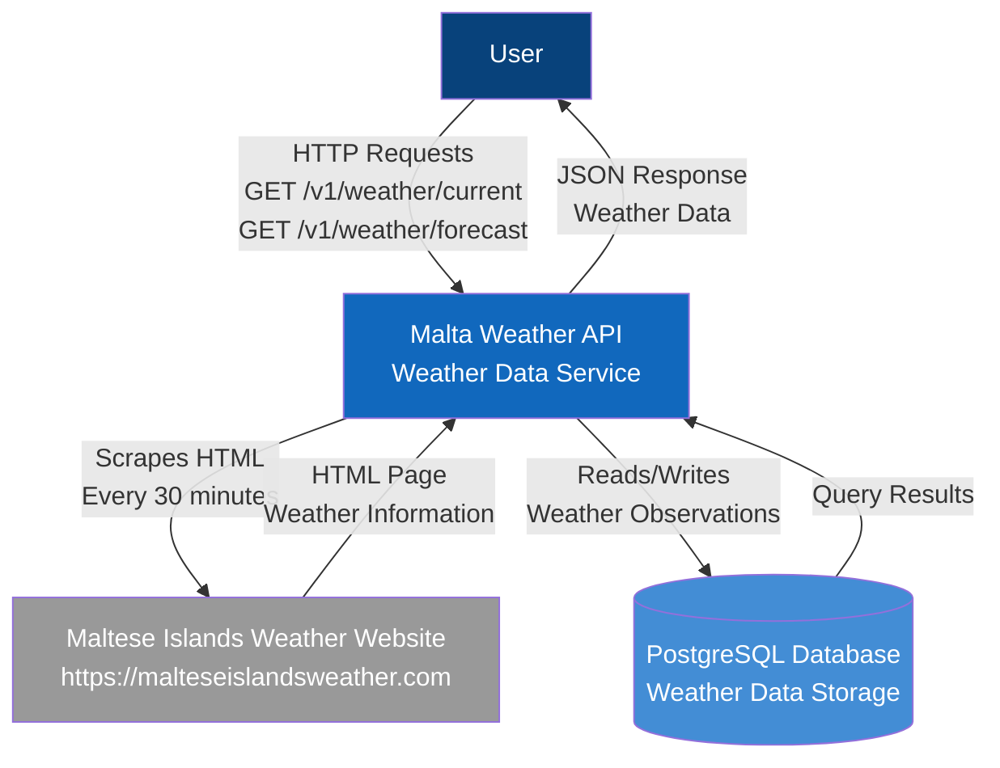

# C4 Context Diagram - Malta Weather API

This diagram shows the system context and how external actors interact with the Malta Weather API system.

## Description

**Malta Weather API** is the central system that:
- Scrapes weather data from the Maltese Islands Weather website every 30 minutes
- Stores the scraped data in a PostgreSQL database
- Exposes versioned REST API endpoints for accessing current and forecast weather data

**Key Actors:**

1. **API Consumer** (User)
   - Web or mobile application developers
   - Consumes JSON weather data via REST API
   - Makes HTTP GET requests to retrieve current weather and forecasts

2. **External Website** (Third-party System)
   - Source of weather data for Malta
   - Provides HTML pages with weather information
   - Scraped responsibly with 30-minute intervals

3. **PostgreSQL Database** (Data Store)
   - Persistent storage for weather observations and forecasts
   - Ensures data integrity with UNIQUE constraints
   - Provides fast query performance with indexes

